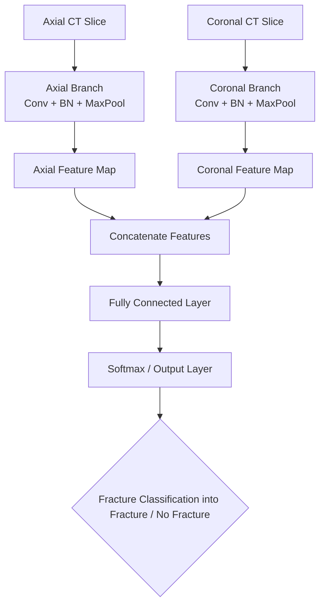
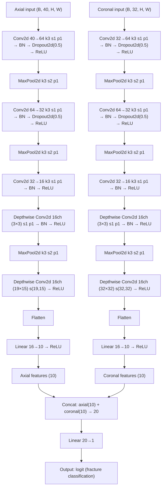
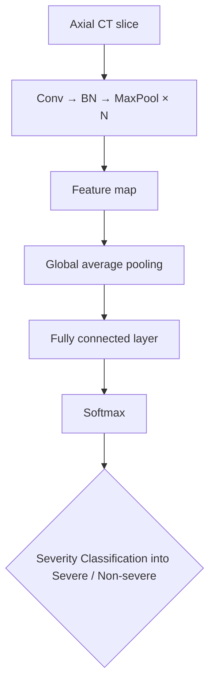
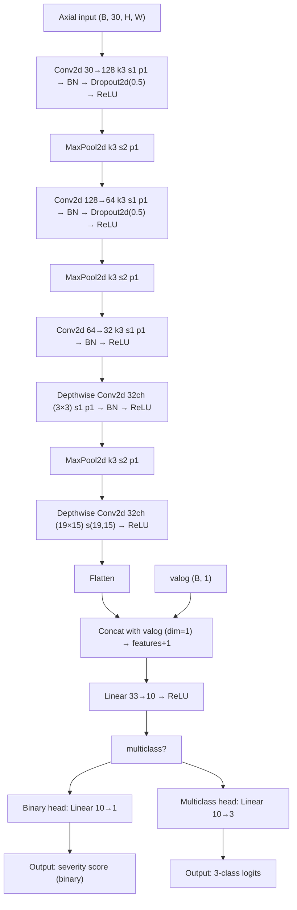

# orbital-injury-detection
Implementation of CNN-based models with Grad-CAM interpretability for automated detection of orbital fractures and severity classification of ocular injuries using CT imaging.

Fracture Detection 
---------------------------------------

Network Architecture

Severity Classification 
---------------------------------------

Network Architecture

