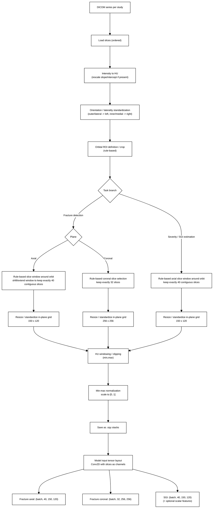

## Preprocessing flow (black & white Mermaid)

```mermaid
%%{init: {"theme":"base","flowchart":{"nodeSpacing":70,"rankSpacing":90},"themeVariables":{
  "background":"#ffffff",
  "primaryColor":"#ffffff",
  "primaryTextColor":"#000000",
  "primaryBorderColor":"#000000",
  "lineColor":"#000000",
  "secondaryColor":"#ffffff",
  "tertiaryColor":"#ffffff",
  "fontFamily":"Arial",
  "fontSize":"10px",
  "nodePadding":18
}}}%%
flowchart TB
  A["DICOM series per study"] --> B["Load slices (ordered)"]
  B --> C["Intensity to HU<br/>(rescale slope/intercept if present)"]
  C --> D["Orientation / laterality standardization<br/>(outer/lateral -> left, inner/medial -> right)"]
  D --> E["Orbital ROI definition / crop<br/>(rule-based)"]

  E --> F{"Task branch"}

  %% Fracture detection branches
  F -->|Fracture detection| G{"Plane"}
  G -->|Axial| H["Rule-based slice window around orbit<br/>shift/extend window to keep exactly 40 contiguous slices"]
  G -->|Coronal| I["Rule-based coronal slice selection<br/>keep exactly 32 slices"]

  H --> J["Resize / standardize in-plane grid<br/>150 x 120"]
  I --> K["Resize / standardize in-plane grid<br/>256 x 256"]

  %% Severity (SGI) branch
  F -->|Severity / SGI estimation| L["Rule-based axial slice window around orbit<br/>keep exactly 40 contiguous slices"]
  L --> M["Resize / standardize in-plane grid<br/>150 x 120"]

  %% Common intensity processing after ROI/slice selection
  J --> N["HU windowing / clipping<br/>(min,max)"]
  K --> N
  M --> N
  N --> O["Min-max normalization<br/>scale to [0, 1]"]

  %% Saved tensors / model input layout
  O --> P["Save as .npy stacks"]
  P --> Q["Model input tensor layout<br/>Conv2D with slices as channels"]

  Q --> R["Fracture axial: (batch, 40, 150, 120)"]
  Q --> S["Fracture coronal: (batch, 32, 256, 256)"]
  Q --> T["SGI: (batch, 40, 150, 120)<br/>(+ optional scalar features)"]
```

